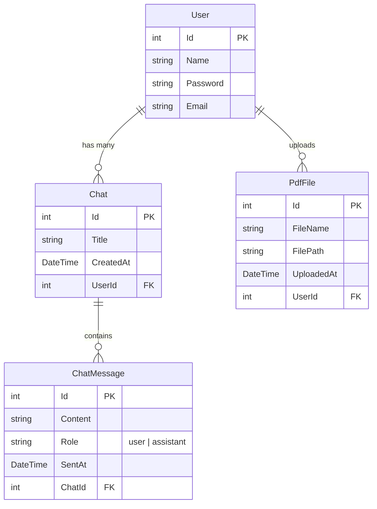

# 📚 Multiple PDF Chat App

<p align="center">
  
  
  
  
  
</p>

---

## 🌟 About the Project
**Multiple PDF Chat** is a comprehensive full-stack application that allows users to upload multiple PDF documents and interact with them through an intelligent, AI-powered chat interface. Built with a modern microservices-like architecture, it ensures secure multi-tenant data isolation, providing a seamless, fast, and secure user experience.

---

## ✨ Key Features

- **🤖 AI-Powered Document Chat:** Ask questions and get intelligent answers based entirely on the contents of the PDF files you've uploaded.
- **📂 Document Management:** Seamlessly upload multiple PDF files simultaneously and easily delete documents you no longer need.
- **💬 Chat Session Management:** Create new chat sessions, maintain your conversation history, and delete old chats anytime.
- **🔐 Robust Authentication:** Secure login and registration flows powered by JWT (JSON Web Tokens) to ensure user data protection.
- **🛡️ Data Isolation (Multi-tenancy):** Every user has their own private workspace. Users cannot access or view files and conversations belonging to others.
- **🐳 Fully Dockerized Environment:** The entire application suite is containerized, allowing for one-click setup and deployment using Docker Compose.

---

## 🛠️ Technology Stack

### 🎨 Frontend (UI)
- **React 19 & Vite:** For lightning-fast build times and a highly interactive user interface.
- **TypeScript:** Ensuring type safety and scalable code quality.
- **Tailwind CSS v4:** For a modern, responsive, and highly customizable design system.
- **Framer Motion:** Adding smooth, engaging micro-animations and transitions.
- **Axios & React Router:** Managing HTTP requests and client-side routing.

### ⚙️ Backend API (.NET Core)
- **.NET Core:** Delivering a robust, high-performance, and reliable RESTful API.
- **Entity Framework Core:** Efficient database ORM for handling relational data.
- **JWT (JSON Web Tokens):** Secure session management and API authorization.

### 🧠 AI Service
- **FastAPI (Python):** A high-performance web framework for processing PDF text extraction and communicating with AI models.

### 🗄️ Database & Storage
- **Microsoft SQL Server 2022:** Persistent, secure storage for user credentials, chat histories, and file metadata.

### 🚀 Deployment & DevOps
- **Docker & Docker Compose:** Containerizing all application components (Frontend, Backend, AI Service, Database) and bridging them through an isolated internal network.

---

## ⚙️ Prerequisites
Before getting started, make sure you have the following installed on your machine:
- [Docker](https://www.docker.com/products/docker-desktop)
- [Docker Compose](https://docs.docker.com/compose/install/)
- An API Key from an AI provider (e.g., OpenAI) configured for your AI Service.

---

## 🚀 How to Run the Application

**1. Clone the repository**
```bash
git clone https://github.com/your-username/Multiple-Pdf-ChaT.git
cd Multiple-Pdf-ChaT
```

**2. Setup Environment Variables**
Create a `.env` file in the root directory of the project and add the following configuration (adjust the values as necessary):

```env
# Database Settings
SA_PASSWORD=YourStrong!Passw0rd
DEFAULT_CONNECTION=Server=database,1433;Database=PdfChatDb;User Id=sa;Password=YourStrong!Passw0rd;TrustServerCertificate=True;

# JWT Authentication
JWT_KEY=YourSuperSecretKeyForJwtAuthentication123!
JWT_ISSUER=YourIssuer
JWT_AUDIENCE=YourAudience

# Network Configuration
VITE_API_URL=http://localhost:4000/api
```
*(Note: Be sure to also include any AI API keys required by the `ai-service` in this file).*

**3. Build and Run via Docker Compose**
Open your terminal in the project root directory and execute:

```bash
docker-compose up --build -d
```
This command will pull the necessary images, build the containers, and run all services in the background.

**4. Access the Services**
Once the containers are up and running, you can access the application through the following URLs:
- **Frontend App:** [http://localhost:4001](http://localhost:4001)
- **Backend API:** [http://localhost:4000](http://localhost:4000) (or its Swagger UI endpoint)
- **AI Service:** [http://localhost:5000](http://localhost:5000)
- **Database (SQL Server):** Accessible locally on port `1344` (and `1433` inside the Docker network).

---

## 🛑 Stopping the Application
To gracefully stop all services and containers, use:
```bash
docker-compose down
```

---

## 📁 Folder Structure

```text
Multiple-Pdf-ChaT/
├── frontend/             # React and Vite application
├── backend/              # .NET Core API project
├── ai-service/           # FastAPI project for AI processing
├── docker-compose.yml    # Docker configuration to run all services
└── .env                  # Environment variables file (ignored in git)
```

---

## 🤝 Contributing
Contributions are always welcome! If you have suggestions or improvements, feel free to open an issue or submit a Pull Request.

## 📄 License
This project is licensed under the [MIT License](LICENSE).

---

## 🗄️ Database Schema (ER Diagram)

Below is the Entity-Relationship (ER) diagram representing the database architecture for the project. 
It highlights the relationships between `User`, `Chat`, `ChatMessage`, and `PdfFile`.


